# learning to reason with llms
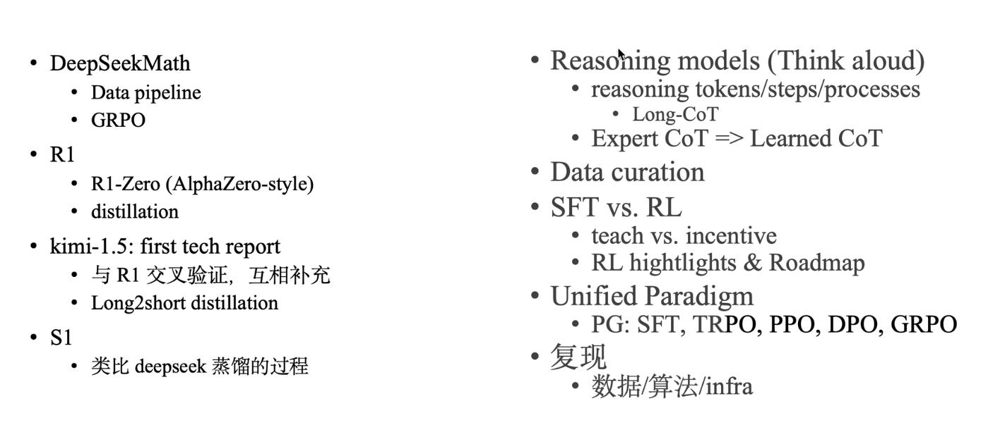

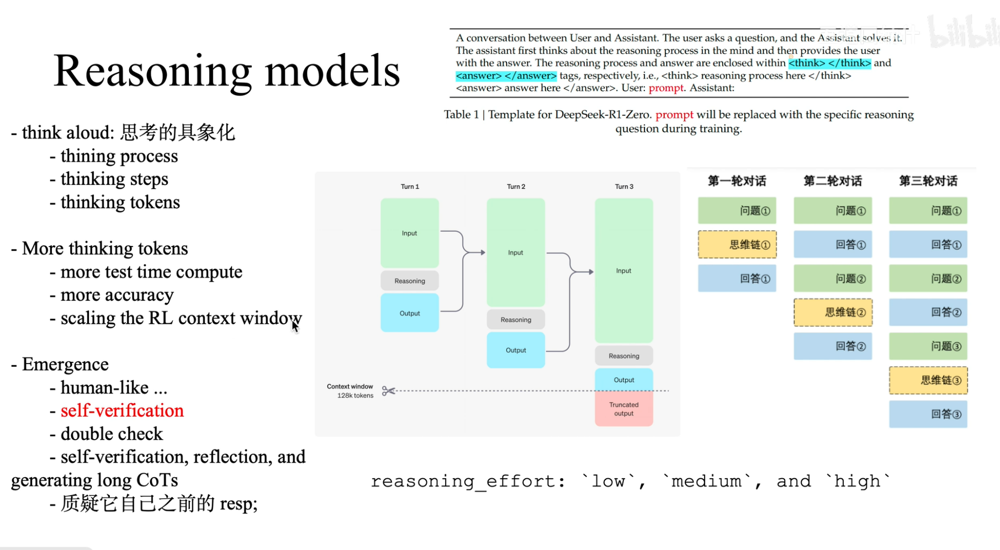

优化步数越多，response长度越大，long context scaling；scaling reasoning tokens...

可能会有proposal，然后再验证....直到找到一个可以的答案。训练过程就是找到一个会给很大reward的解。

<think></think> <answer></answer>

模型回答第二轮问题的时候，第一轮的CoT是不会放到context里面去的。

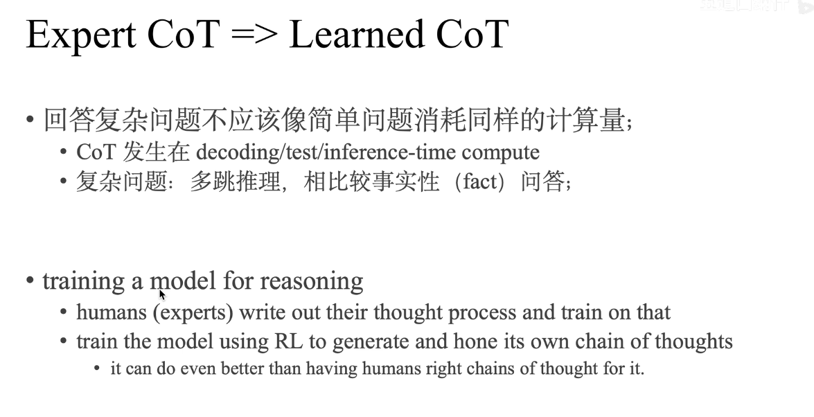

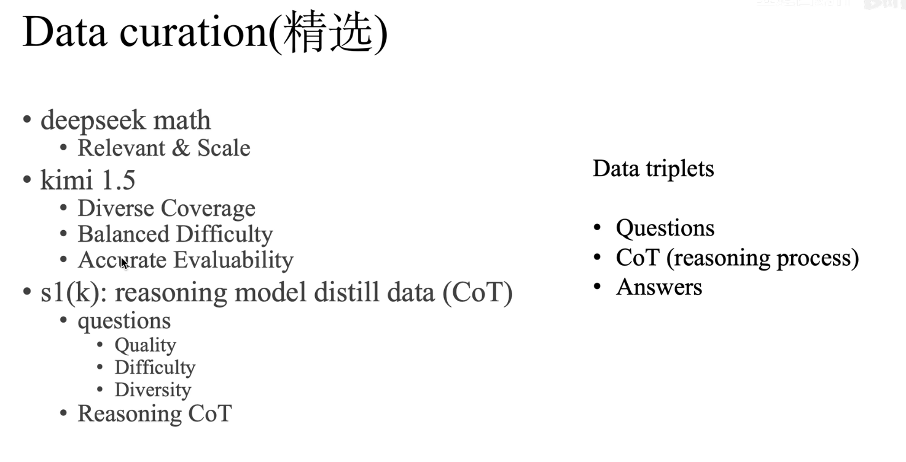

sft vs rl
- 学知识点-pretrain
- 看例题- sft
- 做习题 - rl
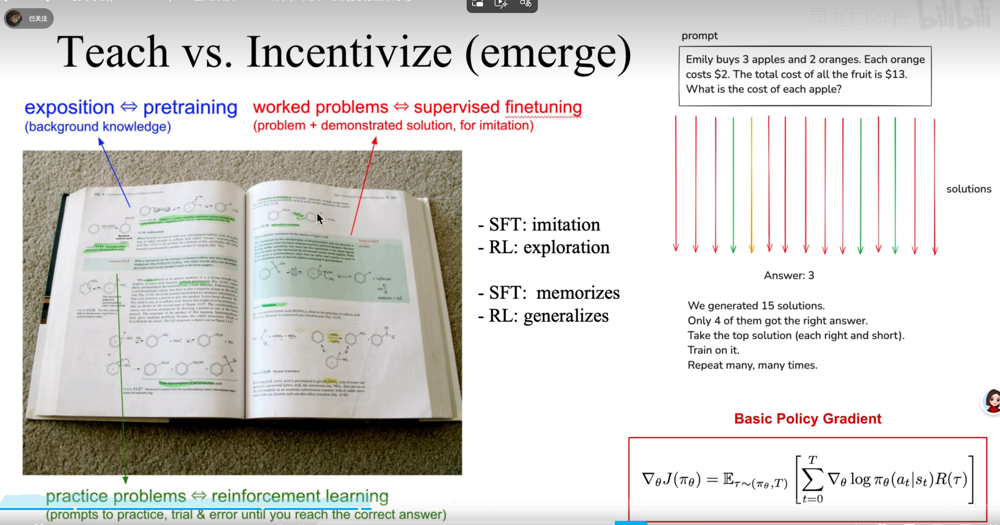

question给模型，让模型探索，基于policy gradient激励正确的答案和思考过程，强化。这就是激励强化，而不是teach。

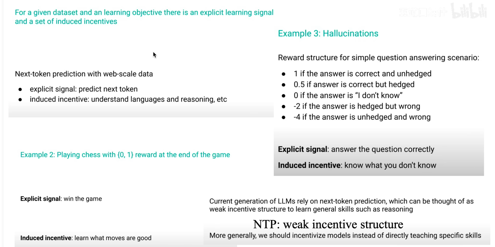
激励模型产生好的行为。看教学视频学打游戏是sft，自己打游戏，看奖励调整行为是rl。

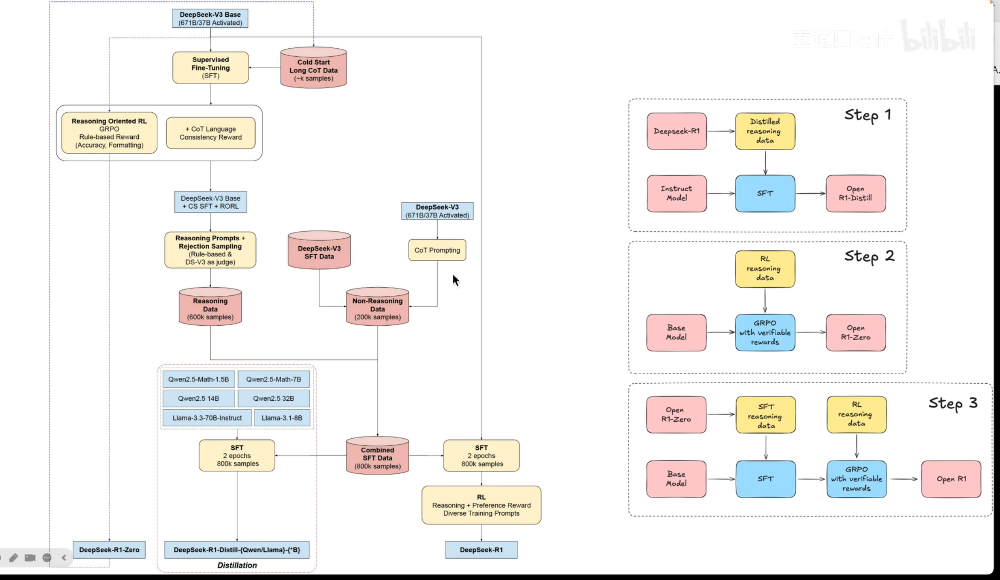
1. 粉色的 表示数据，黄色的表示算法，蓝色的是模型。
2. rl-zero过程，base模型通过grpo（rule-based）得到r1-zero ==> 只产生数据long cot data.
3. v3-base 经过 cot数据 sft，然后grpo + cot一致性性奖励， 得到checkpoints，接着得到800k的sft data，再v3base 做sft，再做rl得到deepseek-r1.
4. 800k的sft data还用于蒸馏。

step1： r1模型做蒸馏。
step2：grpo做r1-zero模型。
step3：得到r1模型。

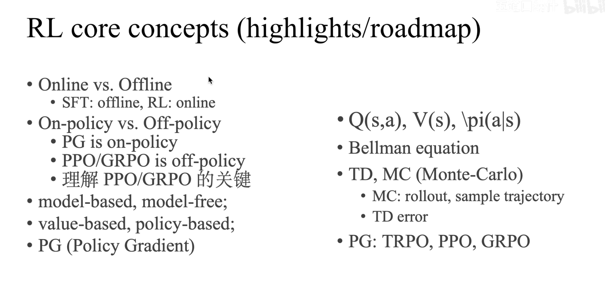
- online：数据是否是从环境交互来的，不是就是offline
- on-policy  off-policy：重要性采样。

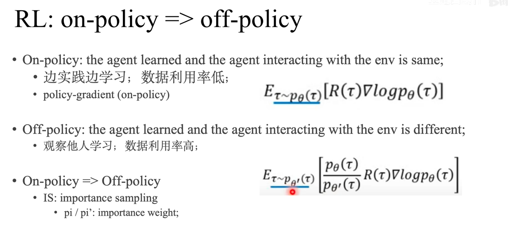
on-policy：训练的要是之前参数生成的序列。

用πtheat撇 产生的数据更新 πtheat

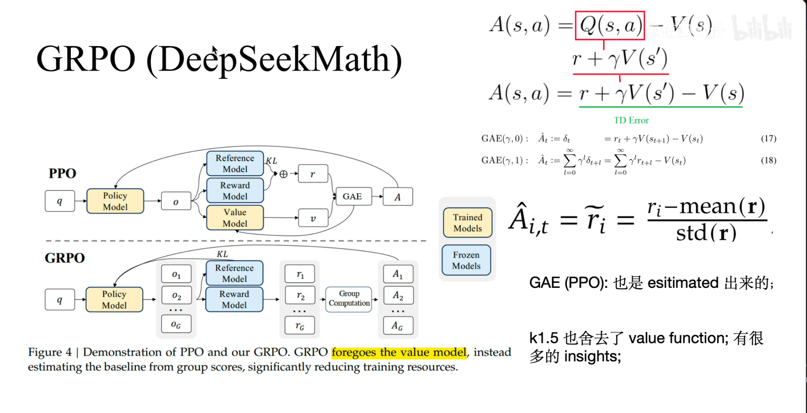
ppo涉及到gae广义优势估计（reward、kl散度、v【value model占用的显存太大啦！】）。
A(s,a) 是下一个状态的优势 - 上一个状态。得到GAE

grpo不涉及到v，sample一组，优势是减去均值再除以方差...【前提是base模型能力强，是会自己生成一些好的回答的】。

kimi1.5 也干掉了value model，错误的路径也可以当做是一个trial and error纠错，认为有助于解决复杂问题。

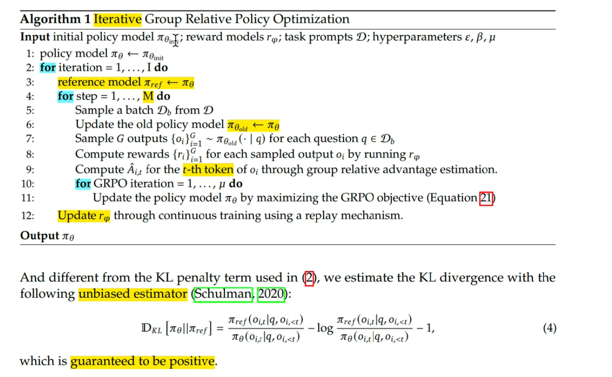

rlhf：
- human feedback（neural_reward model）
- rl(ppo) : critic / value

RL(R1):
- neural_reward_model -> rule based reward function
- grpo: exclude critic network

RLHF => for alignment(helpful, harmless)
RL(R1) => continual learning

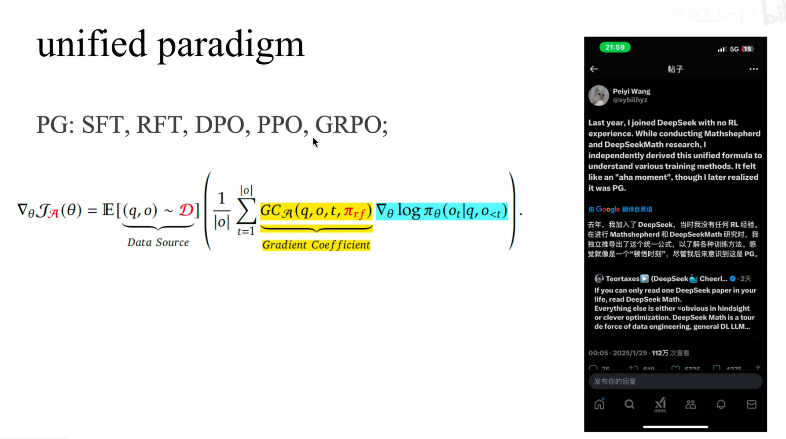

复现：
- 数据
- 算法
- infra： 训练 megatron/fsdp 推理 vllm sglang tgi | rl trainer：verl、openrlhf、trl